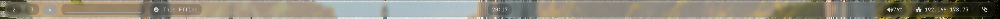

My personal Hyprland dotfiles setup.
___

## Features
- **Waybar**
  - Transparent theme
  - Cava visualizer
  - MPD integration
  - Additional modules
- **Fuzzel** – application launcher
- **Mako** – notification daemon
- **SwayOSD** – on-screen display
- **Neovim** – configured with NVchad
- **Kitty** – terminal emulator
- **Swww** – wallpaper daemon
- **Scripts** – helper scripts 

Everything is automatically themed with `wal`.

___

## Screenshots

- Fullscreen

- Euphonica as MPD frontend

___

- Bar

___

___

