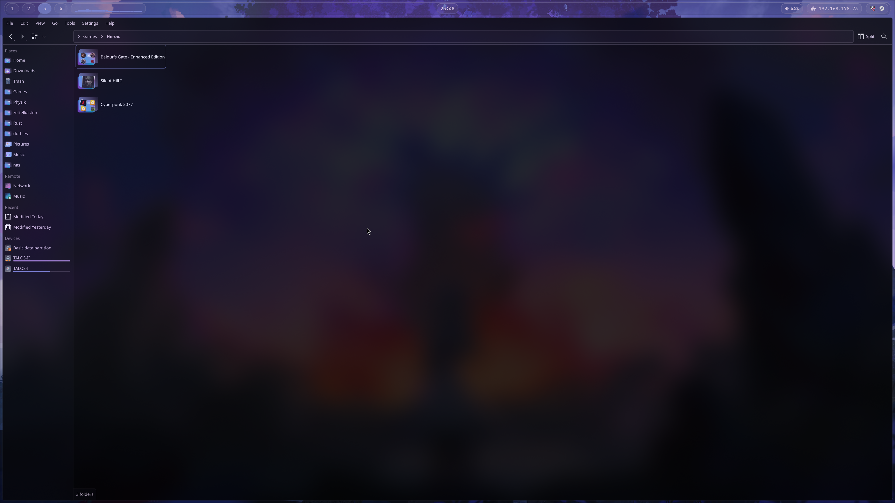
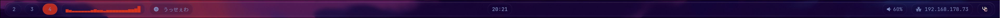
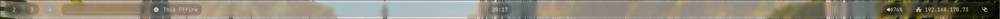
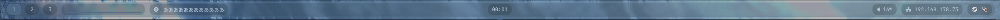

My personal Hyprland dotfiles setup.
___

## Features
- **Waybar** – liquid glass bar with cava visualizer and MPD integration
- **Dolphin** – transparent with KvDarkBlue Kvantum theme, CyberDolphin color scheme, Vivid-Glassy-Dark-Icons
- **Wlogout** – custom glass-style logout screen
- **Fuzzel** – application launcher
- **Mako** – notification daemon
- **SwayOSD** – on-screen display
- **Neovim** – configured with NVchad
- **Kitty** – terminal emulator
- **Swww** – wallpaper daemon
- **Scripts** – wallpaper switching, screenshots (clipboard + file), audio control

Everything is automatically themed with `pywal` — wallpaper changes regenerate colors for waybar, fuzzel, wlogout, Dolphin (CyberDolphin color scheme), and Kvantum (KvDarkBlue).

___

## Screenshots

- Fullscreen

- Dolphin

- Euphonica as MPD frontend

___

- Bar

___

___

